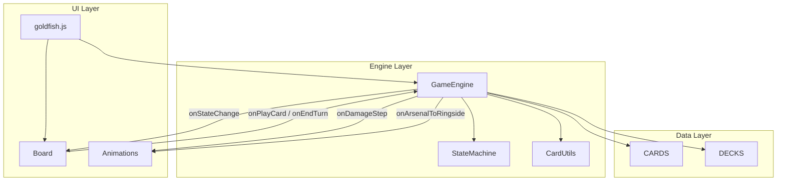

# Raw Deal Game Engine

This document describes how `GameEngine` works in the WWE Raw Deal goldfish mode. The engine is a browser-side, turn-based rules layer that drives the Premiere Edition starter decks. It does not implement the full Raw Deal ruleset — it encodes a deliberately simplified “goldfish” experience where the human plays against a passive opponent.

## Overview

The engine lives under `public/js/games/rawdeal/engine/` and is exposed on the global `window.RawDeal` namespace. `goldfish.js` wires it to the board UI and animation layer.

```
public/js/games/rawdeal/
├── data/
│   ├── cards.js          # Card definitions (generated)
│   └── decks.js          # Starter decks (generated)
├── engine/
│   ├── constants.js      # PHASES, EVENTS, WIN_REASONS
│   ├── stateMachine.js   # Turn-phase transitions
│   ├── gameEngine.js     # Core game logic
│   └── cardUtils.js      # types[], hybrid helpers
├── ui/                   # Board, renderer, animations
└── goldfish.js           # App entry: engine + board
```

Card and deck data are generated from `data/premiere.txt` by `scripts/build-premiere-data.py`. Each physical card copy in a deck gets a unique `instanceId` (e.g. `chop-0`, `chop-1`).

### Goldfish assumptions

| Rule | Engine behavior |
|------|-----------------|
| Players | **Player 0** = human; **Player 1** = passive opponent |
| Opponent turn | No hand plays; opponent only “exists” for Arsenal reversals during damage |
| Fortitude | Sum of **damage (D)** on maneuvers and reversals in the player’s Ring — not printed F |
| Play cost | Printed **F** on the card must be ≤ current fortitude (except action mode, cost 0) |
| Reversals | Revealed from top of opponent Arsenal during damage; require opponent fortitude ≥ reversal F |
| Wins | **Pinfall** (Arsenal empty during damage) or **Count-out** (Arsenal empty at end of turn) |

## Architecture



`GameEngine` owns all authoritative game state. The UI never mutates zones directly — it reads `getPublicState()` and calls engine methods. Animation hooks (`onDamageStep`, `onArsenalToRingside`) defer state commits until `onReveal()` runs, so the board can show flip animations before cards land in Ringside.

## Player state model

Each player object is created in `_createPlayer()`:

| Field | Description |
|-------|-------------|
| `superstar` | Copy of the superstar card from `CARDS` (hand size, SV, id, etc.) |
| `arsenal` | Shuffled draw pile (array of card instances) |
| `hand` | Cards in hand |
| `ringside` | Discard pile |
| `ring` | `{ maneuvers: [], actions: [], reversals: [] }` — in-play cards |
| `fortitude` | Cached total from Ring damage; recalculated via `_syncFortitude()` |
| `superstarAbilityUsed` | Whether the once-per-turn ability was used this turn |
| `isHuman` | `true` for player 0 |
| `deckId` | Key into `DECKS` |

Fortitude is always derived, never manually incremented:

```js
// Sums damage on maneuvers + reversals in Ring
_calcFortitude(player) {
  let total = 0;
  for (const card of [...player.ring.maneuvers, ...player.ring.reversals]) {
    total += card.damage || 0;
  }
  return total;
}
```

Printed fortitude on a card (`card.fortitude`) is only used as the **cost to play** a maneuver/reversal from hand.

## State machine

`StateMachine` (`stateMachine.js`) tracks `phase`, `activePlayer`, and `turnNumber`. Transitions are event-driven; `GameEngine` calls `transition(event, context)` and listens via `onTransition` to fire `onStateChange`.

### Phases

```
SETUP → START_OF_TURN → REFRESH → DRAW → MAIN ⇄ RESOLVING_DAMAGE
                                              ↓
                                         END_OF_TURN → (next player) START_OF_TURN
                                              ↓
                                         GAME_OVER
```

| Phase | Meaning |
|-------|---------|
| `setup` | Before `startGame()` |
| `startOfTurn` | Auto-advances immediately to `refresh` |
| `refresh` | Recalculate fortitude; reset human superstar ability flag |
| `draw` | Active player draws (Mankind draws 2) |
| `main` | Human can play cards or end turn |
| `resolvingDamage` | A maneuver is resolving damage (blocks further plays) |
| `opponentTurn` | Passive opponent “turn” (brief delay, then end) |
| `endOfTurn` | Count-out check, swap active player |
| `gameOver` | Winner decided |

### Events

Defined in `constants.js`: `START_GAME`, `REFRESH_DONE`, `DRAW_DONE`, `PLAY_CARD`, `DAMAGE_DONE`, `END_TURN`, `OPPONENT_DONE`, `RESTART`.

### Who can act

- `canPlayCards()` — `phase === main` and `activePlayer === 0`
- `isPlayerTurn(0)` — `main` or `resolvingDamage` while player 0 is active

Player 1 never enters `main`; after `draw`, the machine goes to `opponentTurn` instead.

### `_runAutoPhases()`

After `startGame()`, `endTurn()`, or a reversal that ends the turn, the engine loops through automatic phases until it reaches `main`, `gameOver`, or `setup`:

1. **START_OF_TURN** — transition with no event (falls through to REFRESH)
2. **REFRESH** — sync fortitude; clear human ability state; `REFRESH_DONE`
3. **DRAW** — draw 1 (or 2 for Mankind); `DRAW_DONE`
4. **OPPONENT_TURN** — 400ms delay; `OPPONENT_DONE`
5. **END_OF_TURN** — `_checkCountOut(opponent)`; if Arsenal empty, game over; else swap players

The loop ends when the human reaches `main` or the game ends.

## Card types and hybrid cards

Cards use a `types` array (legacy single `type` was removed). `CardUtils` provides:

- `getTypes(card)` / `hasType(card, type)` / `isHybrid(card)`
- `canPlayFromHandAs(card, playAs)` — only `maneuver` and `action` are valid hand modes
- `primaryType(card)` — first entry in `types`

**Hybrid example — Chop:**

```js
types: ['maneuver', 'action'],
actionEffect: 'discardToDraw',
actionEffectValue: 1,
```

- **Maneuver (left/yellow):** Goes to Ring, deals damage, costs printed F
- **Action (right/blue):** Discarded to Ringside, draws cards — no Ring placement, no damage, F cost 0

Reversals are not played from hand in goldfish; they are only revealed from the opponent Arsenal during damage.

## Playing a card

### Validation — `canPlayCard(playerIndex, instanceId, playAs)`

1. Must be human main phase (`canPlayCards()`)
2. Card must be in hand
3. `playAs` must be allowed by `CardUtils.canPlayFromHandAs` (defaults to `maneuver` if possible, else `primaryType`)
4. `player.fortitude >= _effectiveFortitudeCost(card, playAs)` (0 for action)

### Pipeline — `playCard(instanceId, playAs)`

```
1. Remove card from hand
2. transition(PLAY_CARD) → RESOLVING_DAMAGE
3. Branch on playAs:
```

**Action mode** (`_playFromHandAsAction`):

1. Push card to Ringside
2. If `actionEffect === 'discardToDraw'`, draw `actionEffectValue` cards
3. Else run `_resolveAction` for ring-style action effects
4. `DAMAGE_DONE` → back to MAIN

**Maneuver / reversal mode:**

1. Push to `ring.maneuvers` or `ring.reversals`
2. `_syncFortitude(player)`
3. `_resolveOnPlayManeuverEffects` (e.g. Kick → top Arsenal card to Ringside)
4. Compute damage: base D, minus 1 if opponent is Mankind, plus `nextManeuverBonus[0]`
5. If damage > 0, `_resolveDamage(opponent, maneuver, damage)`
6. On pinfall → `GAME_OVER`
7. On reversal → `DAMAGE_DONE`, `END_TURN`, `_runAutoPhases()` (opponent’s turn chain)
8. Otherwise → `DAMAGE_DONE` → MAIN

**Legacy path:** Non-hand action types still go to `ring.actions` and call `_resolveAction` (used for action-only cards not played via action mode).

### On-play maneuver effects

Cards with `effect: 'topArsenalToRingside'` or matching text trigger `_topArsenalToRingside`:

1. Pop top of player Arsenal (notify UI — card is “in flight”)
2. `await onArsenalToRingside({ card, sourceManeuver, onReveal })`
3. `onReveal()` pushes card to Ringside and logs
4. Optional `alsoDraw` on source card

### Action effects — `_resolveAction`

| `card.effect` | Behavior |
|---------------|----------|
| `draw` | Draw `effectValue` cards |
| `nextManeuverBonus` | Add to `nextManeuverBonus[playerIndex]` for next maneuver |
| `smackdownHotel` | Draw 1, +6 next maneuver bonus |
| `iAmTheGame` | +3 bonus, draw 2 |

## Damage resolution

`_resolveDamage(opponent, maneuver, damage)` overturns cards one at a time from the **top** of the opponent Arsenal (pop from end of array):

```
for each damage step:
  if arsenal empty → pinfall
  pop top card
  check _reversalStops(overturned, maneuver, opponent)
  await onDamageStep({ card, step, total, maneuver, reversed, onReveal })
  onReveal() → push card to opponent.ringside
  if reversed → return { result: 'reversed', reversedBy }
return { result: 'hit' }
```

`onDamageStep` is async so the UI can animate each flip before committing to Ringside.

### Reversal logic — `_reversalStops`

A card can reverse only if:

1. It is typed as reversal or has a `reverses` array
2. **Opponent fortitude ≥ reversal printed F** (`card.fortitude`)
3. `reverses` matches the maneuver:
   - `low-damage` — maneuver D ≤ `maxDamage` (default 5)
   - Subtype match — `strike`, `grapple`, `submission`, etc.
   - Special combined lists (e.g. Step Aside reverses `strike`)

When a reversal fires, damage stops immediately, the turn ends, and auto-phases run (opponent refresh/draw/opponent turn).

## Win conditions

| Reason | Trigger |
|--------|---------|
| `pinfall` | Opponent Arsenal empty while applying maneuver damage |
| `countOut` | Opponent Arsenal empty at `END_OF_TURN` check |

Winner is player 0 on pinfall; on count-out, the player who **ran out** loses (human empty → opponent wins).

## Superstar abilities

Only Stone Cold and Undertaker have implemented abilities. State is tracked in `abilityFlow` (multi-step UI prompts) and exposed via `getPublicState().superstarAbility`.

### Stone Cold — “Draw & Bottom”

1. `beginSuperstarAbility()` — draw 1, set `abilityFlow.step = 'pickBottom'`
2. `selectForAbility(instanceId)` — chosen hand card goes to **bottom** of Arsenal (`unshift`)
3. Marks `superstarAbilityUsed`, clears flow

Requires non-empty Arsenal. Usable once per turn in main phase.

### Undertaker — “Ringside Salvage”

1. `beginSuperstarAbility()` — `step = 'pickDiscard'`
2. Select 2 hand cards → Ringside
3. `step = 'pickRingside'` — select 1 Ringside card → hand
4. Marks used, clears flow

Requires hand ≥ 2 and Ringside ≥ 1.

`canUseSuperstarAbility(0)` gates the UI button; `selectForAbility` handles each step. Prompts are described in `_publicSuperstarAbility()` for the board.

## Public API

| Method | Description |
|--------|-------------|
| `constructor(options)` | `onStateChange`, `onDamageStep`, `onArsenalToRingside` callbacks |
| `reset()` | Clear players, logs, ability flow; phase → setup |
| `startGame(playerDeckId, opponentDeckId?)` | Build players, deal hands, higher SV goes first, run auto-phases |
| `getPublicState()` | Serializable snapshot for UI (see below) |
| `canPlayCard(0, instanceId, playAs?)` | Whether human can play this card now |
| `playCard(instanceId, playAs?)` | Play from hand; async |
| `endTurn()` | End human turn; async auto-phases |
| `canUseSuperstarAbility(0)` | Ability button enabled |
| `beginSuperstarAbility(0)` | Start ability flow |
| `selectForAbility(instanceId)` | Resolve ability step selection |

### `getPublicState()` shape

```js
{
  phase, activePlayer, turnNumber,
  players: [ /* player 0 public */, /* player 1 public */ ],
  winner, winReason,
  damageLog: [ { card, damage, result, reversedBy, cardsOverturned } ],
  actionLog: [ { message } ],
  canPlay: boolean,
  superstarAbility: { supported, canUse, used, label, prompt },
}
```

**Visibility rules** (`_publicPlayer`):

- Human: full hand and ringside
- Opponent: empty hand; ringside limited to last 8 cards (Arsenal count visible via `arsenalSize`)

## Extension points

### Adding cards

1. Edit or extend `data/premiere.txt`
2. Run `python scripts/build-premiere-data.py` to regenerate `cards.js` / `decks.js`
3. Adjust classification logic in the build script if needed (hybrid detection, reversal parsing, tag-team exclusion via `TAG_TEAM_NUMS`)

New maneuver effects: add detection in `_resolveOnPlayManeuverEffects` or extend `_resolveAction`.

### Adding superstar abilities

1. Add `supported` / label in `_publicSuperstarAbility`
2. Implement `canUseSuperstarAbility` prerequisites
3. Add `beginSuperstarAbility` and `selectForAbility` steps
4. Wire board prompts from `superstarAbility.prompt`

### Animation integration

Always call `onReveal()` inside animation callbacks so engine state and UI stay in sync:

```js
// goldfish.js pattern
onDamageStep: async ({ card, reversed, onReveal }) => {
  await Animations.flipArsenalToRingside(card, fromEl, toEl, {
    onReveal: () => { onReveal(); /* UI extras */ },
    isReversal: reversed,
  });
},
```

If `onReveal` is skipped, cards stay removed from Arsenal but never appear in Ringside in engine state.

### Passive opponent behavior

To give the opponent real turns (hand plays, AI), you would need:

- Route player 1 through `MAIN` instead of `OPPONENT_TURN`
- Implement play selection and call `playCard` for index 1
- Broaden `canPlayCard` / `canPlayCards` beyond player 0

The current structure keeps that boundary at `StateMachine` (DRAW branch) and `canPlayCards()`.

## Related files

| File | Role |
|------|------|
| [`gameEngine.js`](../public/js/games/rawdeal/engine/gameEngine.js) | Core logic |
| [`stateMachine.js`](../public/js/games/rawdeal/engine/stateMachine.js) | Phase transitions |
| [`cardUtils.js`](../public/js/games/rawdeal/engine/cardUtils.js) | Type/hybrid helpers |
| [`constants.js`](../public/js/games/rawdeal/engine/constants.js) | Shared enums |
| [`goldfish.js`](../public/js/games/rawdeal/goldfish.js) | Engine + UI wiring |
| [`build-premiere-data.py`](../scripts/build-premiere-data.py) | Data pipeline |